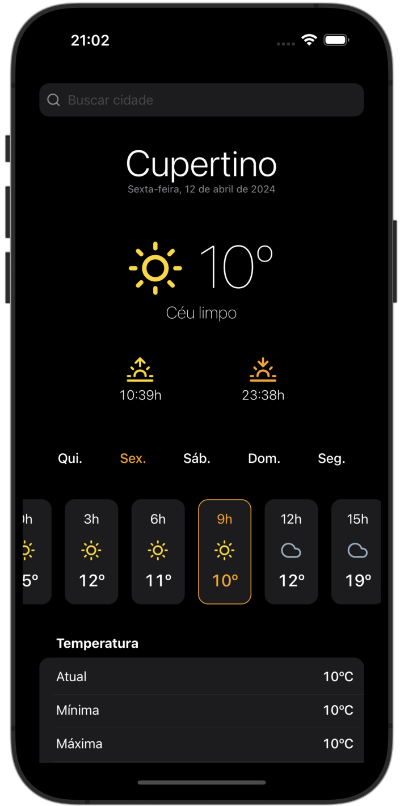
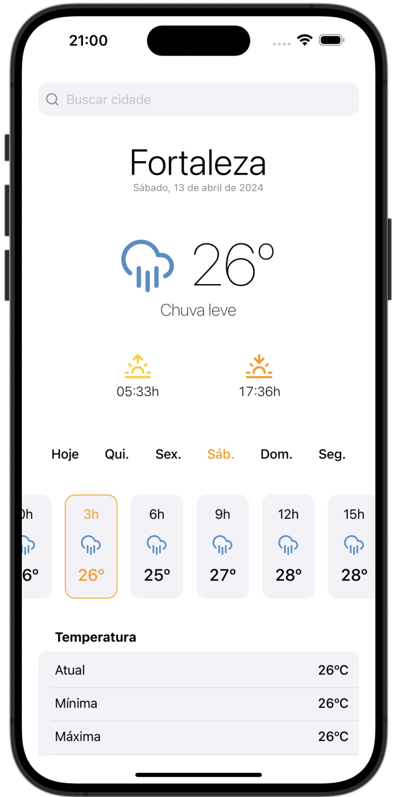

# WeatherApp - Aplicativo de Previsão do Tempo

Aplicativo simples de previsão do tempo desenvolvido em [React Native](https://github.com/facebook/react-native)
utilizando a API [<i>5 dias / 3 horas</i>](https://openweathermap.org/forecast5) da [OpenWeather](https://openweathermap.org/).

<p align="center">
  
  &nbsp;&nbsp;&nbsp;&nbsp;&nbsp;&nbsp;&nbsp;&nbsp;&nbsp;&nbsp;&nbsp;&nbsp;
  
</p>

## Funcionalidades

- **Previsão do tempo por cidade**
  - Os usuários podem pesquisar e visualizar a previsão do tempo para qualquer cidade desejada.
- **Localização atual**
  - Ao abrir o aplicativo, a previsão do tempo para a localização atual do usuário é exibida automaticamente.
- **Detalhes da previsão**
  - Informações detalhadas como temperatura atual, máxima e mínima, condições climáticas, umidade, velocidade do vento, etc., estão disponíveis.
- **Atualização automática**
  - A previsão do tempo é atualizada a cada 3 horas e referente aos próximos 5 dias.
- **Interface intuitiva**
  - Interface de usuário amigável, fácil de usar e adaptável ao tema do dispositivo (claro e escuro).

## Instalação

1. Certifique-se de ter os seguintes programas instalados em sua máquina:
- [Node.js](https://nodejs.org) versão 18 ou maior.
- [Ruby](https://www.ruby-lang.org/) versão 2.6.10 ou maior <i>(apenas iOS)</i>.

2. Clone este repositório:
```bash
git clone https://github.com/pogist/weather-app.git
```

3. Navegue até o diretório do projeto:
```bash
cd weather-app
```

4. Instale as dependências:
```bash
yarn
```
Para iOS, também será necessário instalar dependências nativas utilizando [Cocoapods](https://cocoapods.org/about):
```bash
# 1. Baixe o Cocoapods localmente
bundle install
# 2. Navegue até o diretório `ios`
cd ios
# 3. Utilize sua versão local do Cocoapods
bundle exec pod install
```

5. Crie um arquivo chamado `.env` com as seguintes informações:
```sh
# Chave de API para a Open Weather Map
OPEN_WEATHER_MAP_API_KEY="coloque-sua-chave-aqui"

# URL para a rota de API `5 dias / 3 horas`
FORECAST_API_URL="https://api.openweathermap.org/data/2.5/forecast"
```

6. Inicie o [Metro Bundler](https://metrobundler.dev/):
```bash
yarn start
```

7. Execute o aplicativo:

iOS
```bash
yarn ios # Debug
yarn ios --mode Release # Release
```
Android
```bash
yarn android # Debug
yarn android --mode release # Release
```
Opcionalmente, também é possível executar o aplicativo através do [Xcode](https://developer.apple.com/xcode/) ou do [Android Studio](https://developer.android.com/studio/):

```bash
# Abra o app iOS no Xcode
xed ios

# Abra o app Android no Android Studio
studio android # certifique-se que o launcher está configurado corretamente (https://www.jetbrains.com/help/idea/2024.1/working-with-the-ide-features-from-command-line.html)
```
<p>
  <i>Observação: essa etapa é obrigatória caso queira visualizar ou modificar o código dos módulos nativos.</i>
</p>

## Módulos Nativos
Este aplicativo utiliza APIs nativas para as funcionalidades de Geolocalização (obter localização atual do dispositivo) e
Geocoding (converter nomes de cidade em coordenadas de latitude/longitude). Tais funcionalidades são expostas através
de módulos nativos que podem ser encontrados nos seguintes locais:

<b>TypeScript</b>
- [`src/service/location.ts`](https://github.com/pogist/weather-app/blob/main/src/service/location.ts)
- [`src/service/geocoding.ts`](https://github.com/pogist/weather-app/blob/main/src/service/geocoding.ts)

<b>iOS (Objective-C)</b>
- [`ios/LinxChallenge/Location.h`](https://github.com/pogist/weather-app/blob/main/ios/LinxChallenge/Location.h)
- [`ios/LinxChallenge/Location.m`](https://github.com/pogist/weather-app/blob/main/ios/LinxChallenge/Location.m)
- [`ios/LinxChallenge/Geocoding.h`](https://github.com/pogist/weather-app/blob/main/ios/LinxChallenge/Geocoding.h)
- [`ios/LinxChallenge/Geocoding.m`](https://github.com/pogist/weather-app/blob/main/ios/LinxChallenge/Geocoding.m)

<b>Android (Kotlin)</b>
- [`android/app/src/main/java/com/linxchallenge/LocationModule.kt`](https://github.com/pogist/weather-app/blob/main/android/app/src/main/java/com/linxchallenge/LocationModule.kt)
- [`android/app/src/main/java/com/linxchallenge/GeocodingModule.kt`](https://github.com/pogist/weather-app/blob/main/android/app/src/main/java/com/linxchallenge/GeocodingModule.kt)

## Tecnologias Utilizadas
- [TypeScript](https://www.typescriptlang.org/)
- [React Native](https://reactnative.dev/)
- [Config](https://github.com/lugg/react-native-config) (para chaves de API)
- [Vector Icons](https://github.com/oblador/react-native-vector-icons) (para ícones vetorizados)
- [Autocomplete Dropdown](https://github.com/onmotion/react-native-autocomplete-dropdown) (para a barra de busca)
- [Core Location](https://developer.apple.com/documentation/corelocation) (para geocoding e geolocalização no iOS)
- [Geocoder](https://developer.android.com/reference/android/location/Geocoder) (para geocoding no Android)
- [Google Play Services](https://developers.google.com/android/reference/com/google/android/gms/location/package-summary) (para geolocalização no Android)
